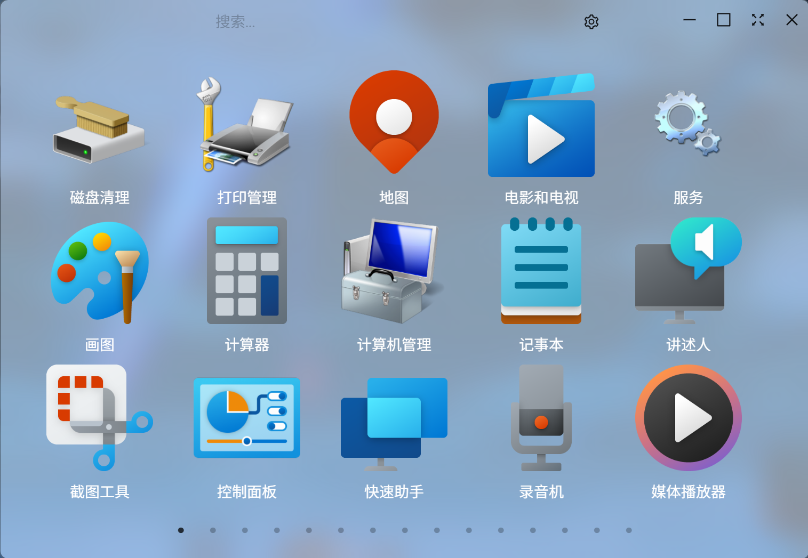
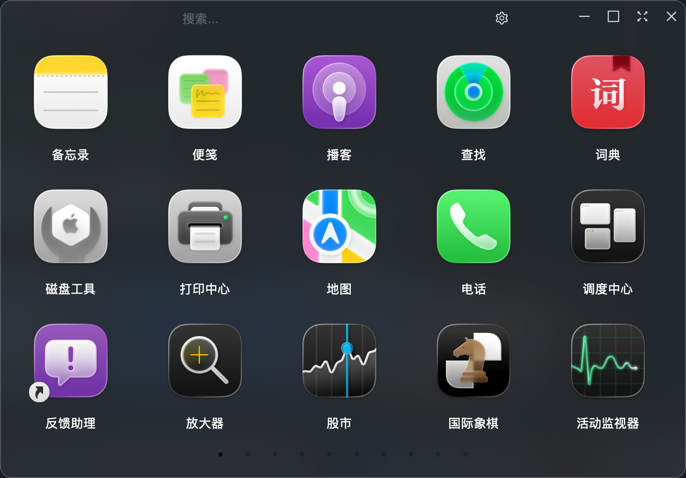

# 软软启动台（qiLaunch）

支持Windows和macOS的软件启动台（Launchpad）





## 🌟主要功能

- 多来源获取软件：可从任务栏固定、桌面、开始菜单、UWP 等来源汇总
- 高清图标提取：有多种提取图标的方式可供选择
- 高度可配置：网格内边距、间距、图标尺寸、字体颜色、排序方式、隐藏列表等

## 🛠️技术栈

- GUI：Tauri
- 前端：TypeScript、Vite、React、Zustand、Ant Design
- 后端：Rust

## 🚀开发与构建

安装依赖

```bash
pnpm install
```

开发模式

```bash
pnpm tauri dev
```

构建应用

```bash
pnpm tauri build
```

## 🤔常见问题

### macOS版本无法打开问题

安装完成后，复制以下命令到终端，然后按回⻋键

```
sudo xattr -r -d com.apple.quarantine /Applications/qiLaunch.app
```

# 🔗下载

下载 https://github.com/CrankZ/qi-launch/releases
